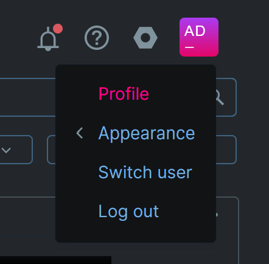
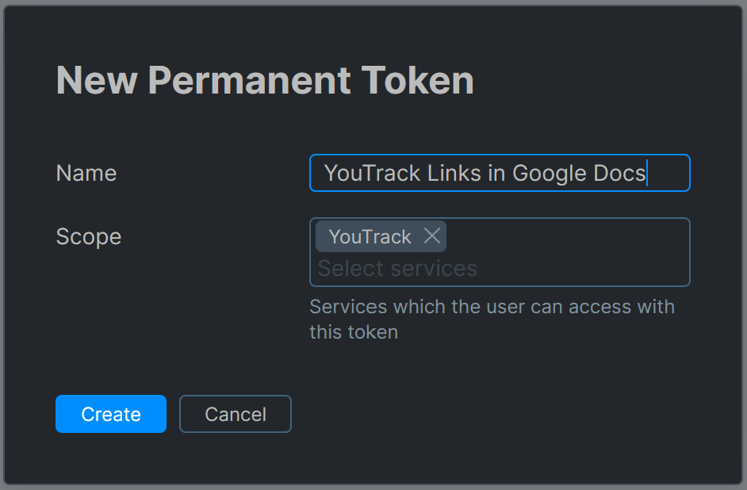

# YouTrack Links for Google Docs

This add-on turns YouTrack issue IDs into clickable links and shows their resolution status directly in your documents. 

Benefits:

 * Faster navigation to YouTrack issues
 * See issue statuses at a glance
 * Automate issues statuses update

## License

MIT License, Copyright (c) 2024 Nikolay Krasko

## Contribution

This project is currently not accepting external contributions.

## Check Issues Statuses

When enabled, *Update Issues Links* action checks issue statuses through the 
[YouTrack REST API](https://www.jetbrains.com/help/youtrack/devportal/youtrack-rest-api.html).

To access information from the server, you need an API token for authorization.

### New token creation

1. To create a new YouTrack token, head to your profile settings: *Profile > Account Security > New Token...* in YouTrack
   
   

   Need more help creating a YouTrack token? Follow the [official guide](https://www.jetbrains.com/help/youtrack/server/manage-permanent-token.html#new-permanent-token).

2. Add **Youtrack Links in Google Docs** as a Name and **YouTrack** as a Scope (name can be different)
    

3. After generating the token, copy and paste it into the **YouTrack Links** add-on settings.

### Token security

A token is saved within Apps Script [PropertiesService](https://developers.google.com/apps-script/reference/properties/properties-service) 
and never shared between users ([getUserProperties()](https://developers.google.com/apps-script/reference/properties/properties-service#getuserproperties)) 
or outside the application.